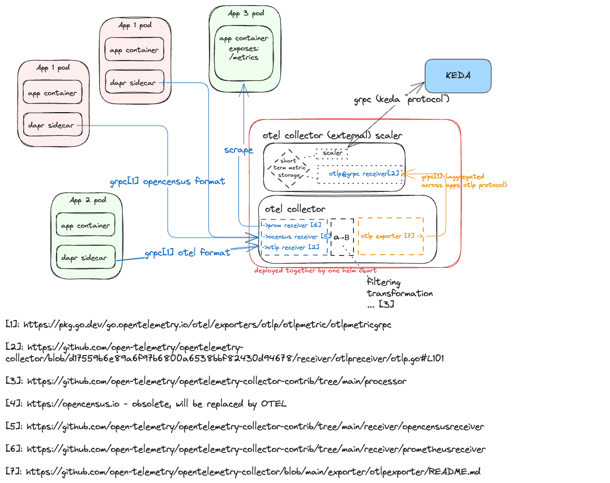

## `OTel <--> KEDA` add-on

[](https://artifacthub.io/packages/search?repo=otel-add-on)

### Description

This is an external scaler for KEDA that intergrates with OpenTelemetry (OTel) collector. The helm chart deploys also OTel
collector (using the [upstream helm chart](https://github.com/open-telemetry/opentelemetry-helm-charts)) where one can set up
filtering so that scaler receives only those metrics that are needed for scaling decisions 
([example](https://github.com/kedify/otel-add-on/blob/v0.0.0-1/helmchart/otel-add-on/values.yaml#L133-L147)).

The application consist of three parts:
- receiver
- simple metric storage
- scaler

#### Receiver

This component is implementation of OTLP Receiver [spec](https://github.com/open-telemetry/opentelemetry-collector-contrib/tree/main/receiver/opencensusreceiver),
so that it spawns a GRPC server ([by default](https://github.com/kedify/otel-add-on/blob/v0.0.0-1/helmchart/otel-add-on/values.yaml#L60) on port `4317`)
and stores all incoming metrics in the short term storage - simple metric storage.

#### Simple Metric Storage

Very simple metric storage designed to remember last couple of measurements (~ 10-100) for each metric vector. It can be 
[configured](https://github.com/kedify/otel-add-on/blob/v0.0.0-1/helmchart/otel-add-on/values.yaml#L11-L12)
with number of seconds to remember. Then during the write operation, it removes the stale measurements, so it effectively works as a
cyclic buffer. Metrics are stored together with labels (key-value pairs) for later querying.

#### External Scaler

This component also spawns GRPC server ([by default](https://github.com/kedify/otel-add-on/blob/v0.0.0-1/helmchart/otel-add-on/values.yaml#L61) on port `4318`)
and can talk to KEDA operator by implementing the External Scaler [contract](https://keda.sh/docs/2.15/concepts/external-scalers/).

It queries the internal in-memory metric storage for metric value and sends it to KEDA operator. The metric query is specified as a metadata on KEDA's
ScaledObject CR, and it provides a limited subset of features as PromQL.

### Architecture

- ([diagram link](https://excalidraw.com/#json=P5ptHj7eQHF3qpCyDDehT,gVJvYLtm0qVR2sStjUlapA))
- [1] [OTLP format](https://pkg.go.dev/go.opentelemetry.io/otel/exporters/otlp/otlpmetric/otlpmetricgrpc)
- [2] [OTLP metric receiver](https://github.com/open-telemetry/opentelemetry-collector/blob/d17559b6e89a6f97b6800a6538bbf82430d94678/receiver/otlpreceiver/otlp.go#L101)
- [3] [processors](https://github.com/open-telemetry/opentelemetry-collector-contrib/tree/main/processor)
- [4] https://opencensus.io - obsolete, will be replaced by OTel
- [5] [OpenCensus receiver](https://github.com/open-telemetry/opentelemetry-collector-contrib/tree/main/receiver/opencensusreceiver)
- [6] [Prometheus receiver](https://github.com/open-telemetry/opentelemetry-collector-contrib/tree/main/receiver/prometheusreceiver)
- [7] [OTLP exporter](https://github.com/open-telemetry/opentelemetry-collector/blob/main/exporter/otlpexporter/README.md)

### Example use-cases

#### 1. convert and react on metrics from OpenCensus

By specifying an [opencensus receiver](https://github.com/kedify/otel-add-on/blob/v0.0.0-1/helmchart/otel-add-on/values.yaml#L112) in the helm chart values for OTel collector,
we will get the ability to get those metrics into our scaler.

#### 2. convert and react on metrics from any other upstream receiver
OTel collector contains [numerous](https://github.com/open-telemetry/opentelemetry-collector-contrib/tree/main/receiver) integrations on the receiver part.
All of these various receivers open new ways of how to turn metric from OTel receiver into KEDA scaler. For instance by using 
[sqlqueryreceiver](https://github.com/open-telemetry/opentelemetry-collector-contrib/tree/main/receiver/sqlqueryreceiver), one can achieve similar goals as with
[MySQL](https://keda.sh/docs/2.15/scalers/mysql/) or [PostgreSQL](https://keda.sh/docs/2.15/scalers/postgresql/) scalers. 
By using [githubreceiver](https://github.com/open-telemetry/opentelemetry-collector-contrib/tree/main/receiver/githubreceiver), one can hook to
metrics from GitBub, etc.

#### 3. process the metrics before reaching the scaler
OTel collector provides [various processors](https://github.com/open-telemetry/opentelemetry-collector-contrib/tree/main/processor)
that are being applied on all incoming metrics/spans/traces and one achieve for instance metric [filtering](https://github.com/kedify/otel-add-on/blob/v0.0.0-1/helmchart/otel-add-on/values.yaml#L138-L143)
this way. So that not all the metric data are passed to scaler's short term memory. This way we can keep the OTel scaler pretty lightweight.

OTTL lang:
- [spec](https://github.com/open-telemetry/opentelemetry-collector-contrib/blob/main/pkg/ottl/LANGUAGE.md)
- [functions](https://github.com/open-telemetry/opentelemetry-collector-contrib/tree/main/pkg/ottl/ottlfuncs)

If the simple metric query is not enough and one requires to combine multiple metric vectors into one or perform simple
arithmetic operations on the metrics, there is the [Metrics Generation Processor](https://github.com/open-telemetry/opentelemetry-collector-contrib/tree/main/processor/metricsgenerationprocessor)
available as an option

#### 4. OTel patterns (metric pipelines)
Basically any scenario described in [OTel patterns](https://github.com/jpkrohling/opentelemetry-collector-deployment-patterns) or [architecture](https://opentelemetry.io/docs/collector/architecture/)
should be supported. So no matter how the OTel collectors are deployed, whether it's a fleet of sidecar containers deployed alongside each workload or
some complex pipeline that spans multiple Kubernetes clusters, you will be covered.

## Installation

### First install KEDA
```bash
helm repo add kedacore https://kedacore.github.io/charts
helm repo update
helm upgrade -i keda kedacore/keda --namespace keda --create-namespace
```

### Then install this add-on
```bash
helm upgrade -i kedify-otel oci://ghcr.io/kedify/charts/otel-add-on --version=v0.0.5
```

### Create an example scaled object
```bash
k apply -f examples/so.yaml
```

## Troubleshooting

To figure out the actual value of a metric query, there is a simple REST api that can be used:

```bash
(kubectl port-forward svc/keda-otel-scaler 9090&)
# swagger doc: http://localhost:9090/swagger/index.html
# test the existing metric query
curl -X 'POST' \
  'http://localhost:9090/memstore/query' \
  -H 'accept: application/json' \
  -H 'Content-Type: application/json' \
  -d '{
  "operationOverTime": "last_one",
  "query": "kube_deployment_status_replicas_available{deployment=foo,namespace=observability}"
}'
{
    "ok": true,
    "operation": "query",
    "error": "",
    "value": 1
}

# check the data if the labels are stored there correctly:
curl -X 'GET' \
  'http://localhost:9090/memstore/data' \
  -H 'accept: application/json' | jq '.kube_deployment_status_replicas_available[].labels'
{
  "deployment": "keda-operator",
  "namespace": "keda"
}
```

### Configuration for OTel collector

This repo has the OTel collector helm chart as a dependency and some issues in the configuration are guarded
by their upstream JSON Schema, but some are not, and it's a good idea to run the validator (especially if it's part
of a CI/CD pipeline):

```
# 1) download the binary
VERSION=0.117.0
curl -sL https://github.com/open-telemetry/opentelemetry-collector-releases/releases/download/v${VERSION}/otelcol-contrib_${VERSION}_$(go env GOOS)_$(go env GOARCH).tar.gz | tar xvz - -C .

# 2) run the validator against your helm chart values
./otel-contrib validate --config=<(cat values.yaml | yq '.opentelemetry-collector.alternateConfig')
```

Alternatively, you may want to use online tools such as [otelbin.io](https://www.otelbin.io/).
