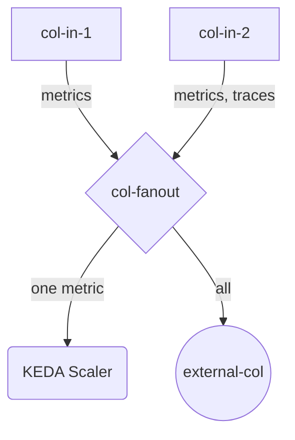

# otel-add-on

  

[](https://artifacthub.io/packages/search?repo=otel-add-on)

A Helm chart for KEDA otel-add-on

```
:::^.     .::::^:     :::::::::::::::    .:::::::::.                   .^.
7???~   .^7????~.     7??????????????.   :?????????77!^.              .7?7.
7???~  ^7???7~.       ~!!!!!!!!!!!!!!.   :????!!!!7????7~.           .7???7.
7???~^7????~.                            :????:    :~7???7.         :7?????7.
7???7????!.           ::::::::::::.      :????:      .7???!        :7??77???7.
7????????7:           7???????????~      :????:       :????:      :???7?5????7.
7????!~????^          !77777777777^      :????:       :????:     ^???7?#P7????7.
7???~  ^????~                            :????:      :7???!     ^???7J#@J7?????7.
7???~   :7???!.                          :????:   .:~7???!.    ~???7Y&@#7777????7.
7???~    .7???7:      !!!!!!!!!!!!!!!    :????7!!77????7^     ~??775@@@GJJYJ?????7.
7???~     .!????^     7?????????????7.   :?????????7!~:      !????G@@@@@@@@5??????7:
::::.       :::::     :::::::::::::::    .::::::::..        .::::JGGGB@@@&7:::::::::
        _       _               _     _                               ?@@#~
   ___ | |_ ___| |     __ _  __| | __| |     ___  _ __                P@B^
  / _ \| __/ _ \ |    / _` |/ _` |/ _` |___ / _ \| '_ \             :&G:
 | (_) | ||  __/ |   | (_| | (_| | (_| |___| (_) | | | |            !5.
  \___/ \__\___|_|    \__,_|\__,_|\__,_|    \___/|_| |_|            ,
                                                                    .
```

**Homepage:** <https://github.com/kedify/otel-add-on>

## Usage

Check available version in OCI repo:
```bash
crane ls ghcr.io/kedify/charts/otel-add-on | grep -E '^v?[0-9]'
```

Install specific version:
```bash
helm upgrade -i oci://ghcr.io/kedify/charts/otel-add-on --version=v0.1.3
```

Advanced stuff:
```bash
# check /examples dir in project root
find ./../../examples -name '*-values.yaml'
```

## Source Code

* <https://github.com/kedify/otel-add-on>
* <https://github.com/open-telemetry/opentelemetry-helm-charts>

## Requirements

Kubernetes: `>= 1.19.0-0`

| Repository | Name | Version |
|------------|------|---------|
| https://open-telemetry.github.io/opentelemetry-helm-charts | otelCollector(opentelemetry-collector) | 0.131.0 |
| https://open-telemetry.github.io/opentelemetry-helm-charts | otelOperator(opentelemetry-operator) | 0.93.0 |

## OTel Collector Sub-Chart

This helm chart, when enabled by `--set otelCollector.enabled=true`, installs the OTel collector using
its upstream [helm chart](https://github.com/open-telemetry/opentelemetry-helm-charts/tree/main/charts/opentelemetry-collector).

To check all the possible values for this dependent helm chart, consult [values.yaml](https://github.com/open-telemetry/opentelemetry-helm-charts/blob/main/charts/opentelemetry-collector/values.yaml)
or [docs](https://github.com/open-telemetry/opentelemetry-helm-charts/blob/main/charts/opentelemetry-collector/README.md).

All these values goes under `otelCollector` section.

Example:

```yaml
settings:
  metricStore:
    retentionSeconds: 60
otelCollector:
  enabled: true
  # <HERE>
  alternateConfig:
    receivers:
    ...
```

## OTel Operator Sub-Chart
Using the `otelCollector` sub-chart (described in the previous section) we can install one instance of OTel collector. However, all
the helm chart values needs to be passed in advance including the OTel collector configuration section. One limitation of Helm is the absence
of templating the helm chart values itself. This would be very useful, because some things in the OTel configuration are dynamic (addresses etc.)

We can achieve that by using the upstream OTel [Operator](https://opentelemetry.io/docs/platforms/kubernetes/operator/) and render[^fn1] its CRDs using this helm chart.

Configuration of `OpenTelemetryCollector` CR is driven by:
- `.otelOperatorCrDefaultTemplate` (defaults)
- `.otelOperatorCrs` (overrides)

> [!TIP]
> If there is a default set on `.otelOperatorCrDefaultTemplate` level, say:
>    ```yaml
>    otelOperatorCrDefaultTemplate:
>      alternateExporters:
>        otlp/central:
>          protocols:
>            grpc:
>              endpoint: external-backup:4317
>    ```
> and we want to make the field `alternateExporters` empty, we can do that by:
>    ```yaml
>    otelOperatorCrDefaultTemplate:
>      alternateExporters:
>        otlp/central:
>          protocols:
>            grpc:
>              endpoint: external-backup:4317
>    otelOperatorCrs:
>      - enabled: true
>        name: "nonDefault"
>        alternateExporters: null
>    ```
> Otherwise, the behavior of the config merge is as expected ([code](https://github.com/kedify/otel-add-on/blob/v0.0.13/helmchart/otel-add-on/templates/_helpers.tpl#L64-L79)).
> Also if the `alternateExporters` field in the merged config is empty, we will create an implicit exporter that will feed the metrics into KEDA OTel scaler with preconfigured service name.
> If from any reason you would like to disable all the exporters for the OTel collector, add only a dummy `debug` exporter:
>    ```bash
>    noglob helm template oci://ghcr.io/kedify/charts/otel-add-on --version=v0.1.3 \
>       --set otelOperatorCrs[0].alternateExporters.debug.verbosity=basic \
>       --set otelOperatorCrs[0].enabled=true
>    ```

So one can deploy whole metric pipeline including multiple OTel collectors with different settings as one helm release using this chart.
You can check the description for `otelOperatorCrDefaultTemplate` in Values [section](#values) for such example.

For:
 - receivers
 - exporters
 - processors
 - extensions
 - pipelines
You can use the `alternate{Receivers,Exporters,Processors,Extensions,Pipelines}` config options on both CR level and default-template level to
tweak the OTel collector config. This has the benefit that it will also enable it under the `.service.pipelines` option so there is no need to
repeat yourself. However, if you want to provide the full OTel collector configuration, you can do that by putting it under `alternateOtelConfig` (again CR level or default template).
When `alternateOtelConfig` is set, all the `alternate{Receivers,Exporters,Processors,Extensions,Pipelines}` are ignored.

## Values

<table>
     <thead>
          <th>Key</th>
          <th width="100px;">Description</th>
          <th>Default</th>
     </thead>
     <tbody>
          <tr>
               <td id="image--repository">
<a href="./values.yaml#L10">image.repository</a><br/>

(Type: string)</td>
               <td>
               Image to use for the Deployment
               </td>
               <td>
                    <div style="max-width: 200px;">
<pre lang="json">
"ghcr.io/kedify/otel-add-on"
</pre>
</div>
               </td>
          </tr>
          <tr>
               <td id="image--pullPolicy">
<a href="./values.yaml#L12">image.pullPolicy</a><br/>
<br/>
(Type: <a target="_blank" href="https://kubernetes.io/docs/concepts/containers/images/#image-pull-policy">image-pull-policy</a>)</td>
               <td>
               image pull policy for KEDA OTel Scaler pod
               </td>
               <td>
                    <div style="max-width: 200px;">
<pre lang="json">
"Always"
</pre>
</div>
               </td>
          </tr>
          <tr>
               <td id="image--tag">
<a href="./values.yaml#L14">image.tag</a><br/>

(Type: string)</td>
               <td>
               Image version to use for the Deployment, if not specified, it defaults to <code>.Chart.AppVersion</code>
               </td>
               <td>
                    <div style="max-width: 200px;">
<pre lang="json">
""
</pre>
</div>
               </td>
          </tr>
          <tr>
               <td id="settings--metricStore--retentionSeconds">
<a href="./values.yaml#L19">settings<br/>.metricStore<br/>.retentionSeconds</a><br/>

(Type: int)</td>
               <td>
               how long the metrics should be kept in the short term (in memory) storage
               </td>
               <td>
                    <div style="max-width: 200px;">
<pre lang="json">
120
</pre>
</div>
               </td>
          </tr>
          <tr>
               <td id="settings--metricStore--lazySeries">
<a href="./values.yaml#L23">settings<br/>.metricStore<br/>.lazySeries</a><br/>

(Type: bool)</td>
               <td>
               if enabled, no metrics will be stored until there is a request for such metric from KEDA operator.
               </td>
               <td>
                    <div style="max-width: 200px;">
<pre lang="json">
false
</pre>
</div>
               </td>
          </tr>
          <tr>
               <td id="settings--metricStore--lazyAggregates">
<a href="./values.yaml#L27">settings<br/>.metricStore<br/>.lazyAggregates</a><br/>

(Type: bool)</td>
               <td>
               if enabled, the only aggregate that will be calculated on the fly is the one referenced in the metric query  (by default, we calculate and store all of them - sum, rate, min, max, etc.)
               </td>
               <td>
                    <div style="max-width: 200px;">
<pre lang="json">
false
</pre>
</div>
               </td>
          </tr>
          <tr>
               <td id="settings--metricStore--errIfNotFound">
<a href="./values.yaml#L30">settings<br/>.metricStore<br/>.errIfNotFound</a><br/>

(Type: bool)</td>
               <td>
               when enabled, the scaler will be returning error to KEDA's <code>GetMetrics()</code> call
               </td>
               <td>
                    <div style="max-width: 200px;">
<pre lang="json">
false
</pre>
</div>
               </td>
          </tr>
          <tr>
               <td id="settings--metricStore--valueIfNotFound">
<a href="./values.yaml#L33">settings<br/>.metricStore<br/>.valueIfNotFound</a><br/>

(Type: float)</td>
               <td>
               default value, that is reported in case of error or if the value is not in the mem store
               </td>
               <td>
                    <div style="max-width: 200px;">
<pre lang="json">
0
</pre>
</div>
               </td>
          </tr>
          <tr>
               <td id="settings--isActivePollingIntervalMilliseconds">
<a href="./values.yaml#L36">settings<br/>.isActivePollingIntervalMilliseconds</a><br/>

(Type: int)</td>
               <td>
               how often (in milliseconds) should the IsActive method be tried
               </td>
               <td>
                    <div style="max-width: 200px;">
<pre lang="json">
500
</pre>
</div>
               </td>
          </tr>
          <tr>
               <td id="settings--internalMetricsPort">
<a href="./values.yaml#L39">settings.internalMetricsPort</a><br/>

(Type: int)</td>
               <td>
               internal (mostly golang) metrics will be exposed on <code>:8080/metrics</code>
               </td>
               <td>
                    <div style="max-width: 200px;">
<pre lang="json">
8080
</pre>
</div>
               </td>
          </tr>
          <tr>
               <td id="settings--restApiPort">
<a href="./values.yaml#L42">settings.restApiPort</a><br/>

(Type: int)</td>
               <td>
               port where rest api should be listening
               </td>
               <td>
                    <div style="max-width: 200px;">
<pre lang="json">
9090
</pre>
</div>
               </td>
          </tr>
          <tr>
               <td id="settings--logs--logLvl">
<a href="./values.yaml#L47">settings.logs.logLvl</a><br/>

(Type: string)</td>
               <td>
               Can be one of 'debug', 'info', 'error', or any integer value > 0 which corresponds to custom debug levels of increasing verbosity
               </td>
               <td>
                    <div style="max-width: 200px;">
<pre lang="json">
"info"
</pre>
</div>
               </td>
          </tr>
          <tr>
               <td id="settings--logs--stackTracesLvl">
<a href="./values.yaml#L50">settings.logs.stackTracesLvl</a><br/>

(Type: string)</td>
               <td>
               one of: info, error, panic
               </td>
               <td>
                    <div style="max-width: 200px;">
<pre lang="json">
"error"
</pre>
</div>
               </td>
          </tr>
          <tr>
               <td id="settings--logs--noColor">
<a href="./values.yaml#L53">settings.logs.noColor</a><br/>

(Type: bool)</td>
               <td>
               if anything else than 'false', the log will not contain colors
               </td>
               <td>
                    <div style="max-width: 200px;">
<pre lang="json">
false
</pre>
</div>
               </td>
          </tr>
          <tr>
               <td id="settings--logs--noBanner">
<a href="./values.yaml#L56">settings.logs.noBanner</a><br/>

(Type: bool)</td>
               <td>
               if anything else than 'false', the log will not print the ascii logo
               </td>
               <td>
                    <div style="max-width: 200px;">
<pre lang="json">
false
</pre>
</div>
               </td>
          </tr>
          <tr>
               <td id="settings--tls--caFile">
<a href="./values.yaml#L60">settings.tls.caFile</a><br/>

(Type: optional)</td>
               <td>
               path to CA certificate. When provided, the client certificate will be verified using this CA where "client" ~ another OTLP exporter.
               </td>
               <td>
                    <div style="max-width: 200px;">
<pre lang="json">
""
</pre>
</div>
               </td>
          </tr>
          <tr>
               <td id="settings--tls--certFile">
<a href="./values.yaml#L62">settings.tls.certFile</a><br/>

(Type: optional)</td>
               <td>
               path to TLS certificate that will be used for OTLP receiver
               </td>
               <td>
                    <div style="max-width: 200px;">
<pre lang="json">
""
</pre>
</div>
               </td>
          </tr>
          <tr>
               <td id="settings--tls--keyFile">
<a href="./values.yaml#L64">settings.tls.keyFile</a><br/>

(Type: optional)</td>
               <td>
               path to TLS key that will be used for OTLP receiver
               </td>
               <td>
                    <div style="max-width: 200px;">
<pre lang="json">
""
</pre>
</div>
               </td>
          </tr>
          <tr>
               <td id="settings--tls--reloadInterval">
<a href="./values.yaml#L67">settings.tls.reloadInterval</a><br/>

(Type: optional)</td>
               <td>
               specifies the duration after which the certificates will be reloaded. This is useful when using the CertManager for rotating the certs mounted as Secrets.
               </td>
               <td>
                    <div style="max-width: 200px;">
<pre lang="json">
"5m"
</pre>
</div>
               </td>
          </tr>
          <tr>
               <td id="settings--tls--keda--certFile">
<a href="./values.yaml#L71">settings.tls.keda.certFile</a><br/>

(Type: optional)</td>
               <td>
               path to TLS certificate that will be used for KEDA gRPC server. If empty, defaults to <code>settings.tls.certFile</code>
               </td>
               <td>
                    <div style="max-width: 200px;">
<pre lang="json">
""
</pre>
</div>
               </td>
          </tr>
          <tr>
               <td id="settings--tls--keda--keyFile">
<a href="./values.yaml#L73">settings.tls.keda.keyFile</a><br/>

(Type: optional)</td>
               <td>
               path to TLS key that will be used for KEDA gRPC server. If empty, defaults to <code>settings.tls.keyFile</code>
               </td>
               <td>
                    <div style="max-width: 200px;">
<pre lang="json">
""
</pre>
</div>
               </td>
          </tr>
          <tr>
               <td id="settings--tls--secrets">
<a href="./values.yaml#L76">settings.tls.secrets</a><br/>

(Type: optional)</td>
               <td>
               list of secrets that will be mounted to deployment's pod. One entry in this list, will create one volume and one volumeMount for pod. This is a convenient way for mounting the certs for TLS, but using <code>.volumes & .volumeMounts</code> for anything advanced will also work.
               </td>
               <td>
                    <div style="max-width: 200px;">
<pre lang="json">
[]
</pre>
</div>
               </td>
          </tr>
          <tr>
               <td id="deploymentStrategy">
<a href="./values.yaml#L83">deploymentStrategy</a><br/>
<br/>
(Type: <a target="_blank" href="https://kubernetes.io/docs/concepts/workloads/controllers/deployment/#strategy">strategy</a>)</td>
               <td>
               one of: RollingUpdate, Recreate
               </td>
               <td>
                    <div style="max-width: 200px;">
<pre lang="json">
"RollingUpdate"
</pre>
</div>
               </td>
          </tr>
          <tr>
               <td id="deployScaler">
<a href="./values.yaml#L86">deployScaler</a><br/>

(Type: bool)</td>
               <td>
               when disabled, the deployment with KEDA Scaler will not be rendered
               </td>
               <td>
                    <div style="max-width: 200px;">
<pre lang="json">
true
</pre>
</div>
               </td>
          </tr>
          <tr>
               <td id="validatingAdmissionPolicy--enabled">
<a href="./values.yaml#L90">validatingAdmissionPolicy<br/>.enabled</a><br/>

(Type: bool)</td>
               <td>
               whether the ValidatingAdmissionPolicy and ValidatingAdmissionPolicyBinding resources should be also rendered
               </td>
               <td>
                    <div style="max-width: 200px;">
<pre lang="json">
false
</pre>
</div>
               </td>
          </tr>
          <tr>
               <td id="asciiArt">
<a href="./values.yaml#L94">asciiArt</a><br/>

(Type: bool)</td>
               <td>
               should the ascii logo be printed when this helm chart is installed
               </td>
               <td>
                    <div style="max-width: 200px;">
<pre lang="json">
true
</pre>
</div>
               </td>
          </tr>
          <tr>
               <td id="imagePullSecrets">
<a href="./values.yaml#L97">imagePullSecrets</a><br/>
<br/>
(Type: <a target="_blank" href="https://kubernetes.io/docs/concepts/containers/images/#specifying-imagepullsecrets-on-a-pod">specifying-imagepullsecrets-on-a-pod</a>)</td>
               <td>
               imagePullSecrets for KEDA OTel Scaler pod
               </td>
               <td>
                    <div style="max-width: 200px;">
<pre lang="json">
[]
</pre>
</div>
               </td>
          </tr>
          <tr>
               <td id="serviceAccount--create">
<a href="./values.yaml#L103">serviceAccount.create</a><br/>

(Type: bool)</td>
               <td>
               should the service account be also created and linked in the deployment
               </td>
               <td>
                    <div style="max-width: 200px;">
<pre lang="json">
true
</pre>
</div>
               </td>
          </tr>
          <tr>
               <td id="serviceAccount--annotations">
<a href="./values.yaml#L106">serviceAccount.annotations</a><br/>

(Type: object)</td>
               <td>
               further custom annotation that will be added on the service account
               </td>
               <td>
                    <div style="max-width: 200px;">
<pre lang="json">
{}
</pre>
</div>
               </td>
          </tr>
          <tr>
               <td id="serviceAccount--name">
<a href="./values.yaml#L108">serviceAccount.name</a><br/>

(Type: string)</td>
               <td>
               name of the service account, defaults to <code>otel-add-on.fullname</code> ~ release name if not overriden
               </td>
               <td>
                    <div style="max-width: 200px;">
<pre lang="json">
""
</pre>
</div>
               </td>
          </tr>
          <tr>
               <td id="podAnnotations">
<a href="./values.yaml#L111">podAnnotations</a><br/>

(Type: object)</td>
               <td>
               additional custom pod annotations that will be used for pod
               </td>
               <td>
                    <div style="max-width: 200px;">
<pre lang="json">
{}
</pre>
</div>
               </td>
          </tr>
          <tr>
               <td id="podLabels">
<a href="./values.yaml#L114">podLabels</a><br/>

(Type: object)</td>
               <td>
               additional custom pod labels that will be used for pod
               </td>
               <td>
                    <div style="max-width: 200px;">
<pre lang="json">
{}
</pre>
</div>
               </td>
          </tr>
          <tr>
               <td id="podSecurityContext">
<a href="./values.yaml#L117">podSecurityContext</a><br/>
<br/>
(Type: <a target="_blank" href="https://kubernetes.io/docs/concepts/security/pod-security-standards">pod-security-standards</a>)</td>
               <td>
               securityContext for KEDA OTel Scaler pod
               </td>
               <td>
                    <div style="max-width: 200px;">
<pre lang="json">
{}
</pre>
</div>
               </td>
          </tr>
          <tr>
               <td id="securityContext">
<a href="./values.yaml#L121">securityContext</a><br/>
<br/>
(Type: <a target="_blank" href="https://kubernetes.io/docs/concepts/security/pod-security-standards">pod-security-standards</a>)</td>
               <td>
               securityContext for KEDA OTel Scaler container
               </td>
               <td>
                    <div style="max-width: 200px;">
<pre lang="yaml">
capabilities:
    drop:
        - ALL
readOnlyRootFilesystem: true
runAsNonRoot: true
runAsUser: 1000

</pre>
</div>
               </td>
          </tr>
          <tr>
               <td id="service--type">
<a href="./values.yaml#L131">service.type</a><br/>
<br/>
(Type: <a target="_blank" href="https://kubernetes.io/docs/concepts/services-networking/service/#publishing-services-service-types">publishing-services-service-types</a>)</td>
               <td>
               Under this service, the otel add on needs to be reachable by KEDA operator and OTel collector
               </td>
               <td>
                    <div style="max-width: 200px;">
<pre lang="json">
"ClusterIP"
</pre>
</div>
               </td>
          </tr>
          <tr>
               <td id="service--otlpReceiverPort">
<a href="./values.yaml#L133">service.otlpReceiverPort</a><br/>

(Type: int)</td>
               <td>
               OTLP receiver will be opened on this port. OTel exporter configured in the OTel collector needs to have this value set.
               </td>
               <td>
                    <div style="max-width: 200px;">
<pre lang="json">
4317
</pre>
</div>
               </td>
          </tr>
          <tr>
               <td id="service--kedaExternalScalerPort">
<a href="./values.yaml#L135">service.kedaExternalScalerPort</a><br/>

(Type: int)</td>
               <td>
               KEDA external scaler will be opened on this port. ScaledObject's <code>.spec.triggers[].metadata.scalerAddress</code> needs to be set to this svc and this port.
               </td>
               <td>
                    <div style="max-width: 200px;">
<pre lang="json">
4318
</pre>
</div>
               </td>
          </tr>
          <tr>
               <td id="service--name">
<a href="./values.yaml#L138">service.name</a><br/>

(Type: string)</td>
               <td>
               name under which the scaler should be exposed, if left empty, it will try .Values.fullnameOverride and if this is empty, name of the release is used this should handle the case when one needs to install multiple instances of this chart into one cluster and at the same time provide a way to specify a stable address
               </td>
               <td>
                    <div style="max-width: 200px;">
<pre lang="json">
""
</pre>
</div>
               </td>
          </tr>
          <tr>
               <td id="resources">
<a href="./values.yaml#L142">resources</a><br/>
<br/>
(Type: <a target="_blank" href="https://kubernetes.io/docs/concepts/configuration/manage-resources-containers">manage-resources-containers</a>)</td>
               <td>
               resources for the OTel Scaler pod
               </td>
               <td>
                    <div style="max-width: 200px;">
<pre lang="yaml">
limits:
    cpu: 500m
    memory: 256Mi
requests:
    cpu: 500m
    memory: 128Mi

</pre>
</div>
               </td>
          </tr>
          <tr>
               <td id="nodeSelector">
<a href="./values.yaml#L162">nodeSelector</a><br/>
<br/>
(Type: <a target="_blank" href="https://kubernetes.io/docs/concepts/scheduling-eviction/assign-pod-node/#nodeselector">nodeselector</a>)</td>
               <td>
               node selector for KEDA OTel Scaler pod
               </td>
               <td>
                    <div style="max-width: 200px;">
<pre lang="json">
{}
</pre>
</div>
               </td>
          </tr>
          <tr>
               <td id="tolerations">
<a href="./values.yaml#L165">tolerations</a><br/>
<br/>
(Type: <a target="_blank" href="https://kubernetes.io/docs/concepts/scheduling-eviction/taint-and-toleration">taint-and-toleration</a>)</td>
               <td>
               tolerations for KEDA OTel Scaler pod
               </td>
               <td>
                    <div style="max-width: 200px;">
<pre lang="json">
[]
</pre>
</div>
               </td>
          </tr>
          <tr>
               <td id="affinity">
<a href="./values.yaml#L168">affinity</a><br/>
<br/>
(Type: <a target="_blank" href="https://kubernetes.io/docs/concepts/scheduling-eviction/assign-pod-node/#affinity-and-anti-affinity">affinity-and-anti-affinity</a>)</td>
               <td>
               affinity for KEDA OTel Scaler pod
               </td>
               <td>
                    <div style="max-width: 200px;">
<pre lang="json">
{}
</pre>
</div>
               </td>
          </tr>
          <tr>
               <td id="kubectlImage">
<a href="./values.yaml#L172">kubectlImage</a><br/>

(Type: yaml)</td>
               <td>
               helper container image that creates the OpenTelemetryCollector CR as post-install helm hook
               </td>
               <td>
                    <div style="max-width: 200px;">
<pre lang="yaml">
tag: "v1.33.1"
repository: ghcr.io/kedify/kubectl
pullPolicy: Always
pullSecrets: []

</pre>
</div>
               </td>
          </tr>
          <tr>
               <td id="otelOperatorCrDefaultTemplate">
<a href="./values.yaml#L276">otelOperatorCrDefaultTemplate</a><br/>

(Type: raw)</td>
               <td>
              
**This field defines the default template for `OpenTelemetryCollector` CR**

Vast majority of the fields has its counterpart described in OpenTelemetryCollector CRD.
In order to check their description, install the CRD and run:
```bash
 kubectl explain otelcol.spec
```
These defaults are then used as a base layer of configuration for all the items in the `.otelOperatorCrs` list.
So given we have this values:

```yaml
otelOperatorCrDefaultTemplate:
  mode: deployment
otelOperatorCrs:
  - enabled: true
    name: "foo"
    mode: "daemonset"
  - enabled: true
    name: "bar"
```
It will render[^fn1] two OpenTelemetryCollector CRs called `foo` and `bar` where `foo` will have the `.spec.mode` set to
`daemonset` and `foo` will inherit the default mode from `.otelOperatorCrDefaultTemplate.mode` => `deployment`
[^fn1]: Well in fact it doesn't render the OpenTelemetryCollector CRs directly, but nested as part of a ConfigMap. Then this
CM is read durin post-install hook and CR is created. This is because we can't render CRD and its instances in one helm command.

 > [!NOTE]
 > When specifying custom receivers, processors, exporters or extensions. Use `alternate{Receivers,Processors,Exporters,Extensions}`.
 > And there is no need to enable these under pipeline section. This is done automagically [here](https://github.com/kedify/otel-add-on/blob/main/helmchart/otel-add-on/templates/install-otc/otc-configmap.yaml).

 > [!TIP]
 > For overriding the whole OTel config, use the `.alternateOtelConfig` field.

Advanced example:
<details>
<summary>Expand</summary>

`values.yaml:`
```yaml
otelOperator:
  enabled: true
otelOperatorCrDefaultTemplate:
  mode: deployment
  alternateReceivers:
    otlp:
      protocols:
        grpc:
          endpoint: 0.0.0.0:4317
  alternateExporters:
    otlp:
      endpoint: col-fanout-collector:4317
      tls:
        insecure: true
otelOperatorCrs:
  - enabled: true
    name: "col-in-1"
  - enabled: true
    name: "col-in-2"
  - enabled: true
    name: "col-fanout"
    alternateExporters:
      otlp/external:
        endpoint: external-collector:4317
      otlp/keda:
        endpoint: keda-otel-scaler.keda.svc:4317
        tls:
          insecure: true
    alternateConnectors:
      routing:
        default_pipelines: [metrics/all]
        table:
          - context: metric
            condition: metric.name == "http_requests_total"
            pipelines: [metrics/keda]
    alternatePipelines:
      metrics/in:
        receivers: [otlp]
        exporters: [routing]
      metrics/keda:
        receivers: [routing]
        exporters: [otlp/keda]
      metrics/all:
        receivers: [routing]
        exporters: [otlp/external]
```
 resulting architecture:


</details>
               </td>
               <td>
                    <div style="max-width: 200px;">
<pre lang="tpl/yaml">

</pre>
</div>
               </td>
          </tr>
          <tr>
               <td id="otelOperatorCrDefaultTemplate--debug">
<a href="./values.yaml#L278">otelOperatorCrDefaultTemplate<br/>.debug</a><br/>

(Type: bool)</td>
               <td>
               container image for post-install helm hook that help with OpenTelemetryCollector CR installation
               </td>
               <td>
                    <div style="max-width: 200px;">
<pre lang="json">
false
</pre>
</div>
               </td>
          </tr>
          <tr>
               <td id="otelOperatorCrDefaultTemplate--mode">
<a href="./values.yaml#L282">otelOperatorCrDefaultTemplate<br/>.mode</a><br/>

(Type: string)</td>
               <td>
               how the otel collector should be deployed: sidecar, statefulset, deployment, daemonset note: make sure the CertManager is installed and admission webhooks are enabled for the OTel operator when using mode=sidecar
               </td>
               <td>
                    <div style="max-width: 200px;">
<pre lang="json">
"deployment"
</pre>
</div>
               </td>
          </tr>
          <tr>
               <td id="otelOperatorCrDefaultTemplate--targetAllocatorEnabled">
<a href="./values.yaml#L285">otelOperatorCrDefaultTemplate<br/>.targetAllocatorEnabled</a><br/>

(Type: bool)</td>
               <td>
               whether TargetAllocator feature (Prometheus Custom Resources for service discovery) should be enabled (<a href="https://github.com/open-telemetry/opentelemetry-operator?tab=readme-ov-file#target-allocator">details</a>) make sure the mode is not set to <code>sidecar</code> when this is enabled
               </td>
               <td>
                    <div style="max-width: 200px;">
<pre lang="json">
false
</pre>
</div>
               </td>
          </tr>
          <tr>
               <td id="otelOperatorCrDefaultTemplate--targetAllocatorClusterRoles">
<a href="./values.yaml#L287">otelOperatorCrDefaultTemplate<br/>.targetAllocatorClusterRoles</a><br/>

(Type: list)</td>
               <td>
               list of existing cluster roles that will be bound to the service account (in order to be able to work with <code>{Pod,Service}Monitor</code> CRD)
               </td>
               <td>
                    <div style="max-width: 200px;">
<pre lang="json">
[
  "kube-prometheus-stack-operator",
  "kube-prometheus-stack-prometheus"
]
</pre>
</div>
               </td>
          </tr>
          <tr>
               <td id="otelOperatorCrDefaultTemplate--targetAllocator--prometheusCR--serviceMonitorSelector">
<a href="./values.yaml#L296">otelOperatorCrDefaultTemplate<br/>.targetAllocator<br/>.prometheusCR<br/>.serviceMonitorSelector</a><br/>

(Type: object)</td>
               <td>
               further narrow the ServiceMonitor CRs (labels)
               </td>
               <td>
                    <div style="max-width: 200px;">
<pre lang="json">
{}
</pre>
</div>
               </td>
          </tr>
          <tr>
               <td id="otelOperatorCrDefaultTemplate--targetAllocator--prometheusCR--podMonitorSelector">
<a href="./values.yaml#L300">otelOperatorCrDefaultTemplate<br/>.targetAllocator<br/>.prometheusCR<br/>.podMonitorSelector</a><br/>

(Type: object)</td>
               <td>
               further narrow the PodMonitor CRs
               </td>
               <td>
                    <div style="max-width: 200px;">
<pre lang="json">
{}
</pre>
</div>
               </td>
          </tr>
          <tr>
               <td id="otelOperatorCrDefaultTemplate--tls">
<a href="./values.yaml#L312">otelOperatorCrDefaultTemplate<br/>.tls</a><br/>

(Type: object)</td>
               <td>
               TLS settings for OTel collector's exporter that feeds the metrics to KEDA OTel scaler it is not in scope of this helm chart to create the secrets with certificate, however this is a convenient way of configuring volumes and volumeMounts for each secret with cert. It has the same structure as tls settings for the scaler (check .Values.tls). One significant difference is that here we specify a client cert for OTLP exporter, while .Values.tls specify the server cert for OTLP receiver
               </td>
               <td>
                    <div style="max-width: 200px;">
<pre lang="json">
{}
</pre>
</div>
               </td>
          </tr>
          <tr>
               <td id="otelOperatorCrDefaultTemplate--resources">
<a href="./values.yaml#L340">otelOperatorCrDefaultTemplate<br/>.resources</a><br/>
<br/>
(Type: <a target="_blank" href="https://kubernetes.io/docs/concepts/configuration/manage-resources-containers">manage-resources-containers</a>)</td>
               <td>
               resources for the OTel collector container
               </td>
               <td>
                    <div style="max-width: 200px;">
<pre lang="yaml">
limits:
    cpu: 400m
    memory: 128Mi
requests:
    cpu: 200m
    memory: 64Mi

</pre>
</div>
               </td>
          </tr>
          <tr>
               <td id="otelOperatorCrDefaultTemplate--alternateOtelConfig">
<a href="./values.yaml#L349">otelOperatorCrDefaultTemplate<br/>.alternateOtelConfig</a><br/>

(Type: object)</td>
               <td>
               free form OTel configuration that will be used for the OpenTelemetryCollector CR (no checks) this is mutually exclusive w/ all the following options
               </td>
               <td>
                    <div style="max-width: 200px;">
<pre lang="json">
{}
</pre>
</div>
               </td>
          </tr>
          <tr>
               <td id="otelOperatorCrDefaultTemplate--prometheusScrapeConfigs">
<a href="./values.yaml#L353">otelOperatorCrDefaultTemplate<br/>.prometheusScrapeConfigs</a><br/>

(Type: list)</td>
               <td>
               static targets for prometheus receiver, this needs to take into account the deployment mode of the collector (127.0.0.1 in case of a sidecar mode will mean something else than for statefulset mode)
               </td>
               <td>
                    <div style="max-width: 200px;">
<pre lang="json">
[
  {
    "job_name": "otel-collector",
    "scrape_interval": "3s",
    "static_configs": [
      {
        "targets": [
          "0.0.0.0:8080"
        ]
      }
    ]
  }
]
</pre>
</div>
               </td>
          </tr>
          <tr>
               <td id="otelOperatorCrDefaultTemplate--alternateReceivers">
<a href="./values.yaml#L359">otelOperatorCrDefaultTemplate<br/>.alternateReceivers</a><br/>

(Type: object)</td>
               <td>
               mutually exclusive with prometheusScrapeConfigs option
               </td>
               <td>
                    <div style="max-width: 200px;">
<pre lang="json">
{}
</pre>
</div>
               </td>
          </tr>
          <tr>
               <td id="otelOperatorCrDefaultTemplate--includeMetrics">
<a href="./values.yaml#L363">otelOperatorCrDefaultTemplate<br/>.includeMetrics</a><br/>

(Type: list)</td>
               <td>
               if not empty, only following metrics will be sent. This translates to filter/metrics processor. Empty array means include all.
               </td>
               <td>
                    <div style="max-width: 200px;">
<pre lang="json">
[]
</pre>
</div>
               </td>
          </tr>
          <tr>
               <td id="otelOperatorCrs">
<a href="./values.yaml#L414">otelOperatorCrs</a><br/>

(Type: yaml)</td>
               <td>
               create also OpenTelemetryCollector CRs that will be reconciled by OTel Operator it takes all the default settings defined in <code>otelOperatorCrDefaultTemplate</code> and allows overriding them here
               </td>
               <td>
                    <div style="max-width: 200px;">
<pre lang="yaml">
# -- if enabled, the OpenTelemetryCollector CR will be created using post-install hook job_name
- enabled: false
  # -- name of the OpenTelemetryCollector CR. If left empty, the release name will be used.
  name: ""
  # -- in what k8s namespace the OpenTelemetryCollector CR should be created. If left empty, the release namespace will be used.
  namespace: ""
- name: target-allocator
  enabled: false
  targetAllocatorEnabled: true
  mode: deployment

</pre>
</div>
               </td>
          </tr>
          <tr>
               <td id="otelOperatorCrs[0]">
<a href="./values.yaml#L416">otelOperatorCrs[0]</a><br/>

(Type: object)</td>
               <td>
               if enabled, the OpenTelemetryCollector CR will be created using post-install hook job_name
               </td>
               <td>
                    <div style="max-width: 200px;">
<pre lang="json">
{
  "enabled": false,
  "name": "",
  "namespace": ""
}
</pre>
</div>
               </td>
          </tr>
          <tr>
               <td id="otelOperatorCrs[0]--name">
<a href="./values.yaml#L418">otelOperatorCrs[0].name</a><br/>

(Type: string)</td>
               <td>
               name of the OpenTelemetryCollector CR. If left empty, the release name will be used.
               </td>
               <td>
                    <div style="max-width: 200px;">
<pre lang="json">
""
</pre>
</div>
               </td>
          </tr>
          <tr>
               <td id="otelOperatorCrs[0]--namespace">
<a href="./values.yaml#L420">otelOperatorCrs[0].namespace</a><br/>

(Type: string)</td>
               <td>
               in what k8s namespace the OpenTelemetryCollector CR should be created. If left empty, the release namespace will be used.
               </td>
               <td>
                    <div style="max-width: 200px;">
<pre lang="json">
""
</pre>
</div>
               </td>
          </tr>
          <tr>
               <td id="otelOperator">
<a href="./values.yaml#L431">otelOperator</a><br/>

(Type: yaml)</td>
               <td>
               values for OTel operator helm chart - these values overrides the defaults defined <a href="https://github.com/open-telemetry/opentelemetry-helm-charts/blob/opentelemetry-operator-0.92.3/charts/opentelemetry-operator/values.yaml">here</a> by default the operator is <code>disabled</code>
               </td>
               <td>
                    <div style="max-width: 200px;">
<pre lang="yaml">
enabled: false
fullnameOverride: otel-operator
manager:
    collectorImage:
        #      repository: otel/opentelemetry-collector-k8s
        repository: otel/opentelemetry-collector-contrib
    env:
        ENABLE_WEBHOOKS: "false"
    serviceAccount:
        name: otel-operator
admissionWebhooks:
    create: false

</pre>
</div>
               </td>
          </tr>
          <tr>
               <td id="otelCollector">
<a href="./values.yaml#L449">otelCollector</a><br/>

(Type: yaml)</td>
               <td>
               values for OTel collector helm chart - these values overrides the defaults defined <a href="https://github.com/open-telemetry/opentelemetry-helm-charts/tree/opentelemetry-collector-0.140.0/charts/opentelemetry-collector/values.yaml">here</a> by default the collector is <code>disabled</code>
               </td>
               <td>
                    <div style="max-width: 200px;">
<pre lang="yaml">
# -- If enabled, the OTel collector sub-chart will be rendered
enabled: false
# -- Valid values are "daemonset", "deployment", "sidecar" and "statefulset"
mode: deployment
image:
    #    repository: otel/opentelemetry-collector-k8s
    repository: otel/opentelemetry-collector-contrib
    # -- Container image - OTel collector distribution
fullnameOverride: otelcol
#  ports:
#    opencensus:
#      enabled: true
#      containerPort: 55678
#      servicePort: 55678
#      hostPort: 55678
#      protocol: TCP
# -- Configuration for OTel collector that will be installed
# @notationType -- yaml
alternateConfig:
    receivers: {}
    processors:
        resourcedetection/env:
            detectors: [env]
            timeout: 2s
            override: false
        transform:
            metric_statements:
                - context: datapoint
                  statements:
                    - set(attributes["namespace"], resource.attributes["k8s.namespace.name"])
                    - set(attributes["pod"], resource.attributes["k8s.pod.name"])
                    - set(attributes["deployment"], resource.attributes["k8s.deployment.name"])
    exporters:
        otlp:
            # make sure this is the same hostname and port as .service (when using different namespace)
            endpoint: keda-otel-scaler.keda.svc:4317
            compression: "none"
            tls:
                insecure: true
        debug:
            verbosity: detailed
    service:
        extensions:
            - health_check
        pipelines:
            metrics:
                receivers: []
                processors: [resourcedetection/env, transform]
                exporters: [debug, otlp]
    extensions:
        health_check:
            endpoint: ${env:MY_POD_IP}:13133

</pre>
</div>
               </td>
          </tr>
          <tr>
               <td id="otelCollector--enabled">
<a href="./values.yaml#L451">otelCollector.enabled</a><br/>

(Type: bool)</td>
               <td>
               If enabled, the OTel collector sub-chart will be rendered
               </td>
               <td>
                    <div style="max-width: 200px;">
<pre lang="json">
false
</pre>
</div>
               </td>
          </tr>
          <tr>
               <td id="otelCollector--mode">
<a href="./values.yaml#L453">otelCollector.mode</a><br/>

(Type: string)</td>
               <td>
               Valid values are "daemonset", "deployment", "sidecar" and "statefulset"
               </td>
               <td>
                    <div style="max-width: 200px;">
<pre lang="json">
"deployment"
</pre>
</div>
               </td>
          </tr>
          <tr>
               <td id="otelCollector--alternateConfig">
<a href="./values.yaml#L468">otelCollector.alternateConfig</a><br/>

(Type: yaml)</td>
               <td>
               Configuration for OTel collector that will be installed
               </td>
               <td>
                    <div style="max-width: 200px;">
<pre lang="yaml">
receivers: {}
processors:
    resourcedetection/env:
        detectors: [env]
        timeout: 2s
        override: false
    transform:
        metric_statements:
            - context: datapoint
              statements:
                - set(attributes["namespace"], resource.attributes["k8s.namespace.name"])
                - set(attributes["pod"], resource.attributes["k8s.pod.name"])
                - set(attributes["deployment"], resource.attributes["k8s.deployment.name"])
exporters:
    otlp:
        # make sure this is the same hostname and port as .service (when using different namespace)
        endpoint: keda-otel-scaler.keda.svc:4317
        compression: "none"
        tls:
            insecure: true
    debug:
        verbosity: detailed
service:
    extensions:
        - health_check
    pipelines:
        metrics:
            receivers: []
            processors: [resourcedetection/env, transform]
            exporters: [debug, otlp]
extensions:
    health_check:
        endpoint: ${env:MY_POD_IP}:13133

</pre>
</div>
               </td>
          </tr>
     </tbody>
</table>

<!-- uncomment this for markdown style (use either valuesTableHtml or valuesSection)
docs: https://github.com/norwoodj/helm-docs?tab=readme-ov-file#markdown-rendering
(( template "chart.valuesSection" . )) -->

<p align="center">
  
</p>
