# Autoscale from CloudWatch Metric Streams

This example scales an nginx Deployment from an AWS Network Load Balancer's
`NewFlowCount` metric. CloudWatch serializes the metric as OpenTelemetry 1.0,
and the OTel Collector forwards it to the KEDA OTel scaler.

## Architecture

```mermaid
flowchart LR
    Client[load generator] --> WorkloadNLB[workload NLB]
    WorkloadNLB --> Workload[nginx Deployment]
    WorkloadNLB -. NewFlowCount .-> CloudWatch[CloudWatch Metric Stream<br/>OTel 1.0]
    CloudWatch --> Firehose[Amazon Data Firehose]
    Firehose -->|HTTPS :443| ReceiverNLB[collector NLB]
    ReceiverNLB -->|Firehose HTTP envelope :4433| Collector[OTel Collector<br/>awsfirehose receiver]
    Collector -->|OTLP/gRPC| Scaler[KEDA OTel scaler]
    Scaler --> KEDA[KEDA]
    KEDA -->|changes replicas| Workload
```



CloudWatch Metric Streams do not send ordinary OTLP directly to the scaler.
They put length-delimited OTLP records into Data Firehose, which wraps them in
its own HTTP request format. The contrib Collector's
[`awsfirehose` receiver](https://github.com/open-telemetry/opentelemetry-collector-contrib/tree/v0.132.0/receiver/awsfirehosereceiver)
unwraps that request before exporting normal OTLP/gRPC to the scaler.

## Requirements

- An EKS cluster with the
  [AWS Load Balancer Controller](https://docs.aws.amazon.com/eks/latest/userguide/aws-load-balancer-controller.html)
  and available pod capacity. Its public subnets must be discoverable by the
  controller (normally tagged `kubernetes.io/role/elb=1`).
- AWS credentials allowed to create CloudFormation, IAM, ACM, Firehose,
  CloudWatch, S3, Route 53, and ELB resources, and to query the Resource Groups
  Tagging API during retry-safe cleanup.
- A public Route 53 hosted zone in the same AWS account. Its domain must be
  publicly delegated so ACM can complete DNS validation.
- `aws`, `kubectl`, `helm`, `curl`, `jq`, `envsubst`, `openssl`, `base64`,
  `grep`, `seq`, `xargs`, and `date` CLIs.

Firehose custom HTTP destinations must be publicly reachable over HTTPS on
port 443. The collector NLB terminates TLS with the ACM certificate and exposes
only the Firehose receiver. A randomly generated access key authenticates every
Firehose request; the default OTLP, Jaeger, and Zipkin ports are disabled.
The scaler and Collector do not mount Kubernetes API credentials, and the
public-facing Collector runs non-root with a read-only root filesystem.

## Run

When the account has exactly one public Route 53 hosted zone, only the cluster
context and Region are needed:

```bash
export KUBE_CONTEXT=my-eks-context
export AWS_REGION=us-east-2

./setup.sh
```

Setup selects that zone, generates a dedicated name such as
`cw-otel-12345678.example.com`, and deploys
[`certificate.yaml`](./certificate.yaml). CloudFormation requests the regional
ACM certificate, creates its Route 53 DNS validation CNAME, and waits for the
certificate to be issued.

If the account has multiple public zones, set a hostname and setup will select
the most-specific matching zone, or select the zone explicitly:

```bash
export FIREHOSE_HOSTNAME=cloudwatch-otel.example.com
# Optional when FIREHOSE_HOSTNAME uniquely identifies its hosted zone:
export ROUTE53_HOSTED_ZONE_ID=Z0123456789EXAMPLE
```

Set `ACM_CERTIFICATE_ARN` only to reuse an already issued certificate instead
of creating one. It must be in `AWS_REGION` and cover `FIREHOSE_HOSTNAME`; a
caller-supplied certificate is never deleted by cleanup. `TLS_STACK_NAME`
overrides the default automatic certificate stack name `${STACK_NAME}-tls`.

`setup.sh` creates all Kubernetes resources in the
`cloudwatch-metric-stream` namespace. If KEDA is missing, it installs KEDA in
the `keda` namespace and leaves it in place during cleanup. The AWS resources
are kept in a CloudFormation stack named `kedify-cloudwatch-metric-stream` by
default. Override that with `STACK_NAME` if needed.

The scripts freeze `KUBE_CONTEXT` for their entire run. Setup records the
cluster UID and stack name on the namespace and tags the CloudFormation stack;
setup and cleanup refuse a same-named namespace or stack whose ownership does
not match.

The setup runs [`verify.sh`](./verify.sh) automatically. It first waits for an
initial datapoint so traffic is not generated while a new metric stream is
still starting. It then restores the minimum replica baseline, starts traffic
in a fresh CloudWatch one-minute interval, opens 200 separate connections
through the workload NLB, and requires a datapoint with that interval's source
timestamp to cause KEDA to increase the Deployment's desired replicas. To make
that transition unambiguous on reruns, it temporarily caps `maxReplicaCount` at
the minimum while collecting the datapoint, restores the original maximum, and
also restores it from an exit trap if verification is interrupted. Set
`RUN_VERIFICATION=false` to skip this step, or tune it with `REQUEST_COUNT`,
`CONCURRENCY`, `STREAM_READY_TIMEOUT_SECONDS`, `BASELINE_TIMEOUT_SECONDS`, and
`VERIFY_TIMEOUT_SECONDS`.

CloudWatch emits Network Load Balancer metrics once per minute. Firehose is
configured with a zero-second HTTP buffer, but a newly created metric stream
can take several minutes to deliver its first batch. The verifier allows 15
minutes for initial delivery, up to 10 minutes to restore the minimum replica
baseline on a rerun, and another 15 minutes for the generated traffic. The
scaler retains metrics for 10 minutes so a delayed point is not stale as soon
as it arrives.

To inspect the result:

```bash
kubectl --context "$KUBE_CONTEXT" \
  get scaledobject,hpa,deployment,pod -n cloudwatch-metric-stream

kubectl --context "$KUBE_CONTEXT" \
  port-forward -n cloudwatch-metric-stream \
  service/cloudwatch-otel-scaler 9090:9090
curl -s http://127.0.0.1:9090/memstore/data | \
  jq '.amazonaws_com_AWS_NetworkELB_NewFlowCount_sum'
```

## Metric shape

CloudWatch produces a Summary named
`amazonaws.com/AWS/NetworkELB/NewFlowCount`. The scaler exposes a Summary's
useful CloudWatch `Sum` statistic with an `_sum` suffix and normalizes `/` and
`.` to `_`, resulting in:

```text
amazonaws_com_AWS_NetworkELB_NewFlowCount_sum
```

Metric Streams include several dimension combinations for the same NLB metric.
The Collector drops every vector except the one-dimensional `LoadBalancer`
vector for this example's NLB, then flattens the nested CloudWatch `Dimensions`
map into this queryable label:

```text
amazonaws_com_AWS_NetworkELB_NewFlowCount_sum{LoadBalancer=net/name/id}
```

`operationOverTime` is `last_one`, not `rate`: `NewFlowCount_sum` is already the
number of connections during CloudWatch's one-minute interval, rather than a
cumulative counter.

The same pattern works with other metrics whose `Sum` statistic is meaningful,
such as `AWS/ApplicationELB/RequestCount` or
`AWS/NetworkELB/ProcessedBytes`. Change the CloudFormation filter, Collector
filter, and ScaledObject query together.

## Troubleshooting

Check the Collector and scaler first:

```bash
kubectl --context "$KUBE_CONTEXT" logs -n cloudwatch-metric-stream \
  deployment/cloudwatch-firehose-receiver --tail=100
kubectl --context "$KUBE_CONTEXT" logs -n cloudwatch-metric-stream \
  deployment/cloudwatch-otel-scaler --tail=100
```

Then retrieve the Firehose log group and metric stream from the stack:

```bash
aws cloudformation describe-stacks \
  --region "$AWS_REGION" \
  --stack-name "${STACK_NAME:-kedify-cloudwatch-metric-stream}" \
  --query 'Stacks[0].Outputs'
```

Common failures are an ACM certificate that does not cover
`FIREHOSE_HOSTNAME`, a private or pre-existing DNS record, an unhealthy
collector NLB target, and insufficient worker-node pod capacity.

## Clean up

The example creates two NLBs plus billable CloudWatch Metric Streams, Firehose,
Route 53, S3, and log resources. Remove them when finished:

```bash
AWS_REGION="$AWS_REGION" \
KUBE_CONTEXT="$KUBE_CONTEXT" \
STACK_NAME="${STACK_NAME:-kedify-cloudwatch-metric-stream}" \
./cleanup.sh
```

The failed-delivery bucket is retained by CloudFormation so stack deletion
cannot fail on a non-empty bucket. `cleanup.sh` deletes its scoped contents and
then the bucket after Firehose has been removed. If cleanup is interrupted
after stack deletion, a rerun recovers the bucket name from the owned namespace
annotation, with its example and Kubernetes cluster ownership tags as a
fallback. Setup refuses to replace a deleted stack while that annotation still
records a retained bucket, so an interrupted cleanup cannot silently orphan it.
After both NLBs are gone, cleanup also deletes the automatically managed ACM
certificate stack and its exact DNS validation record. It leaves a certificate
supplied through `ACM_CERTIFICATE_ARN` untouched.
