# Use-case: pipelines

This use-case demonstrates complex scenario where we deploy whole monitoring pipeline. Multiple OTel collectors - one per each workload replica as sidecar. These
sidecars pushes metrics using OTLP/gRPC into another OTel collector called "router".

This router collector is responsible for sending metrics that are used for scaling into KEDA OTel Scaler and at the same time rely all the incoming metrics to Prometheus.

Example also contain a Grafana dashboard and cert manager that rotates each certificate for each component.


## Architecture



## How to

```bash
./setup.sh
```
