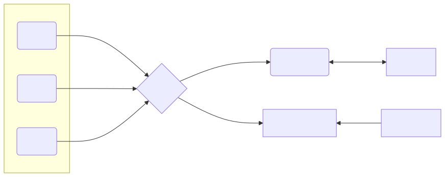

# Use-case: pipelines

This use-case demonstrates a complex scenario where we deploy a whole monitoring pipeline. Multiple OTel collectors - one per each workload replica as a sidecar. These
sidecars push metrics using OTLP/gRPC into another OTel collector called "router".

This router collector is responsible for sending metrics that are used for scaling into KEDA OTel Scaler and at the same time relaying all the incoming metrics to Prometheus.

The example also contains a Grafana dashboard and cert-manager that rotates each certificate for each component.


## Architecture



## How to

```bash
./setup.sh
```
